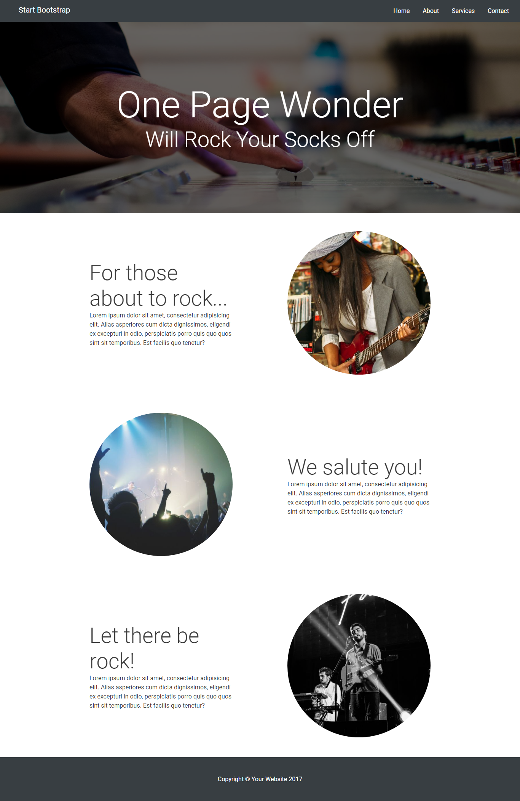

# Rock Site

* **Curso:** _Crea tu propia red social_
* **Unidad:** _La web desde un móvil_

***
Replicar esta pagina:

<https://laboratoria-learning.github.io/rock-site/>

Haciendo uso de las grillas podemos hacer una página web responsive.

